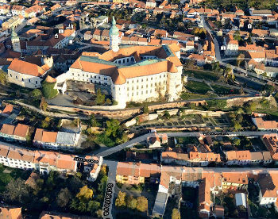

<a href="https://github.com/melown/melown-js"></a>

VTS-Browser-JS is the JavaScript WebGL 3D maps rendering engine. This is, what
you see, if you check [Melown's homepage](http://melown.com) or [3D view at
Mapy.cz](https://mapy.cz/zakladni?x=14.4006&y=50.09074&z=18&m3d=1&height=320.90983232728126&yaw=20.261&pitch=-26.708). For more examples, check [Melown map examples page](https://www.melown.com/maps/index.html#examples)



## Documentation

* [VTS-Browser-JS Documentation](https://www.melown.com/documentation.html)

## Source code

* Source code is hosted on [GitHub](https://github.com/melown/melown-js)

```
git clone https://github.com/melown/melown-js
```
